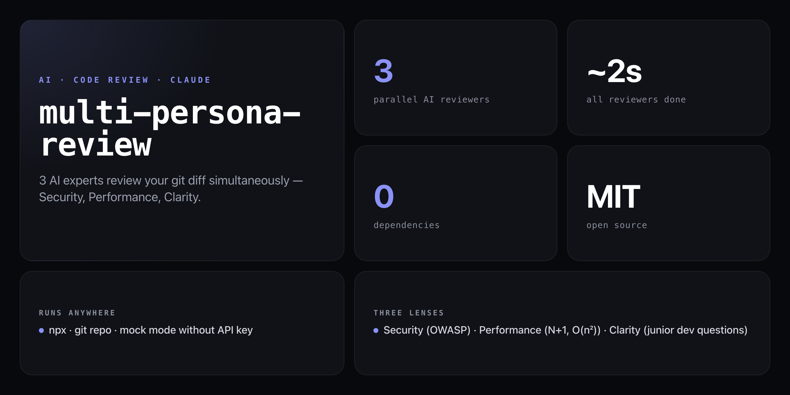

<div align="center">

**One diff. Three angles. Two seconds.**


</div>

---

Send your git diff to three Claude AI reviewers at the same time. Each has a completely different lens. All three fire in parallel via `Promise.all()` — so you get all three results in the time of the slowest single call (~2–3 s instead of ~9 s sequential).

```
━━━━━━━━━━━━━━━━━━━━━━━━━━━━━━━━━━━━━━━━━━━━━━━━━━━
  MULTI-PERSONA REVIEW
  Diff: HEAD~1..HEAD  |  3 reviewers  |  parallel
━━━━━━━━━━━━━━━━━━━━━━━━━━━━━━━━━━━━━━━━━━━━━━━━━━━

Calling 3 reviewers in parallel... done in 2.3s

🔐 THE PARANOID SECURITY REVIEWER
─────────────────────────────────
CRITICAL: Line 47 — SQL query built with string concatenation
  sql = "SELECT * FROM users WHERE id = " + userId
  Fix: Use parameterized queries: db.query("...WHERE id = $1", [userId])

HIGH: Line 23 — API key hardcoded in source
  const KEY = "sk-prod-abc123..."
  Fix: Move to environment variable, add to .gitignore

⚡ THE PERFORMANCE MONK
─────────────────────────
SIGNIFICANT: Lines 12-34 — N+1 query pattern detected
  User.findAll() followed by user.getPosts() inside loop
  Fix: Use eager loading with JOIN or Promise.all()

🤔 THE JUNIOR DEV WHO ASKS WHY
────────────────────────────────
Why does processUser() also send emails? Shouldn't that be separate?
What happens if userId is null on line 47?
What does the magic number 3600 mean — shouldn't it be MAX_SESSION_SECONDS?

━━━━━━━━━━━━━━━━━━━━━━━━━━━━━━━━━━━━━━━━━━━━━━━━━━━
VERDICT: 1 CRITICAL | 1 HIGH | 1 SIGNIFICANT | 3 QUESTIONS
Review took: 2.3 seconds (parallel)
━━━━━━━━━━━━━━━━━━━━━━━━━━━━━━━━━━━━━━━━━━━━━━━━━━━
```

## Install

No npm account needed — runs straight from GitHub:

```bash
npx github:NickCirv/multi-persona-review
```

Or clone and link the `mpr` command globally:

```bash
git clone https://github.com/NickCirv/multi-persona-review
cd multi-persona-review
npm link
```

## Setup

```bash
export ANTHROPIC_API_KEY=sk-ant-your-key-here
```

No key? It still runs — each persona shows what it would look for (mock mode).

## Usage

```bash
# Review last commit with all 3 personas (default)
mpr

# Review a specific range
mpr --diff main..HEAD

# Review only one file
mpr --file src/auth.js

# Use specific personas only
mpr --personas security
mpr --personas security,performance

# Save the review to ./reviews/
mpr --save

# Help
mpr --help
```

| Flag | Description |
|------|-------------|
| `--diff <range>` | Git diff range (default: `HEAD~1`). E.g. `main..HEAD`, `HEAD~3..HEAD` |
| `--file <path>` | Review a specific file's diff only |
| `--personas <list>` | `all` (default) or comma-separated: `security`, `performance`, `clarity` |
| `--save` | Save full review to `./reviews/TIMESTAMP-review.md` |
| `--help`, `-h` | Show help |

## The three reviewers

| Reviewer | Focus |
|----------|-------|
| 🔐 **The Paranoid Security Reviewer** | OWASP vulns, SQL injection, XSS, command injection, hardcoded secrets, auth bypasses, SSRF, path traversal |
| ⚡ **The Performance Monk** | N+1 queries, O(n²) algorithms, blocking calls, memory leaks, missing `Promise.all()`, unnecessary object creation |
| 🤔 **The Junior Dev Who Asks Why** | Confusing names, magic numbers, missing error handling, functions doing too much, unhandled edge cases |

## Why parallel?

All three API calls fire simultaneously. Sequential would be ~6–9 s. Parallel is ~2–3 s — the time of the slowest single call.

```js
const [security, performance, clarity] = await Promise.all([
  callClaude(apiKey, PERSONAS.security, diff),
  callClaude(apiKey, PERSONAS.performance, diff),
  callClaude(apiKey, PERSONAS.clarity, diff),
]);
```

## Model

Uses `claude-haiku-4-5-20251001` — fast and cheap. 400 tokens per persona, 3 parallel calls.

## What it is NOT

- **Not a replacement for human review.** It surfaces issues quickly — a human reviewer still owns the final call.
- **Not a static analysis tool.** It reads natural language diffs, not ASTs. It can miss things a linter would catch and vice versa.
- **Not a git history scanner.** It reviews the diff you point it at, not your entire commit history. For history scanning, see [secret-scan](https://github.com/NickCirv/secret-scan).

---

<div align="center">
<sub>Zero dependencies · Node 18+ · MIT · by <a href="https://github.com/NickCirv">NickCirv</a></sub>
</div>
